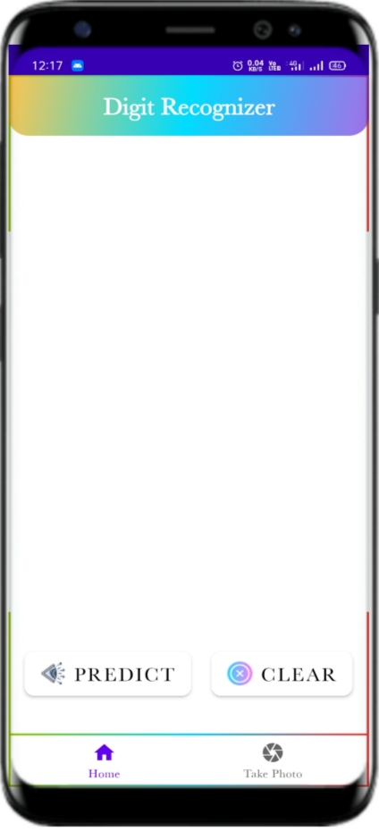
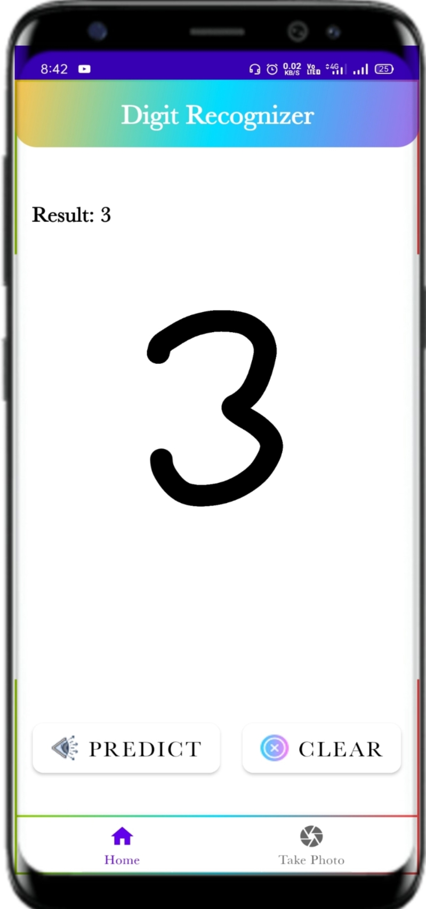
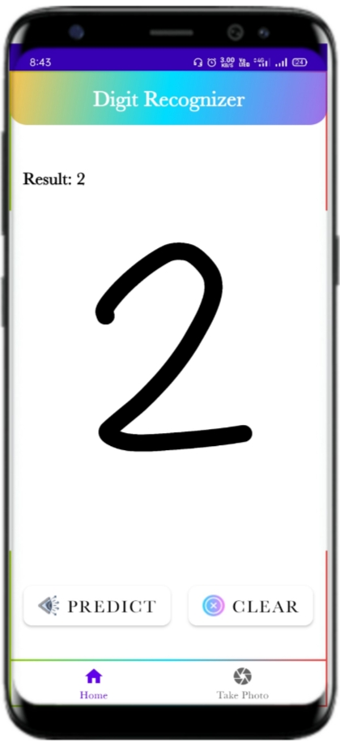
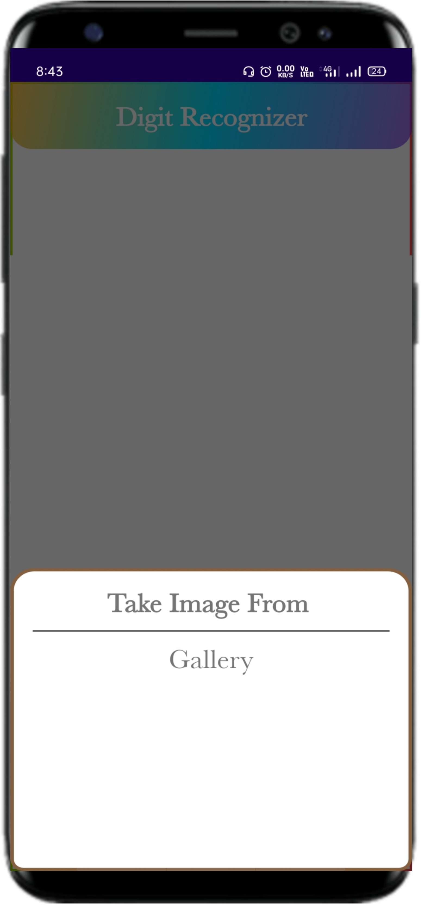
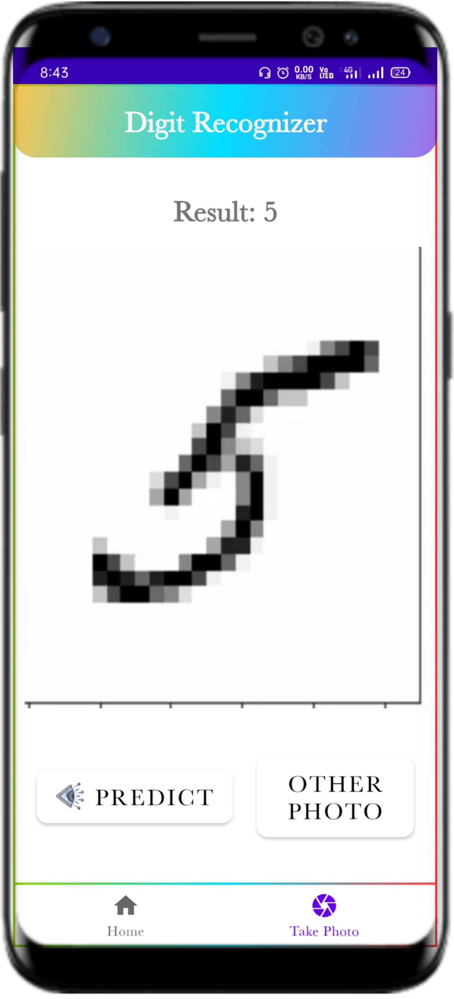
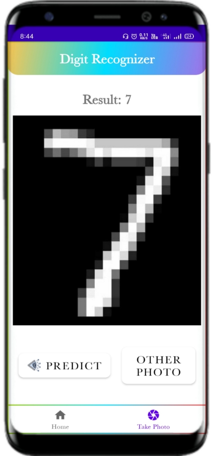

<h1>Digit Predictor App</h1>

This app predicts the digit using ANN (Artificial neural network) model. 
ANN model develops in Pytorch. Mainly, Two features are available in this app.
First, predict the digit using canvas (draw the digit on the screen of app) and 
second, predict the digit using file (means pick a image from gallery).

<h2>Screenshots</h2>

